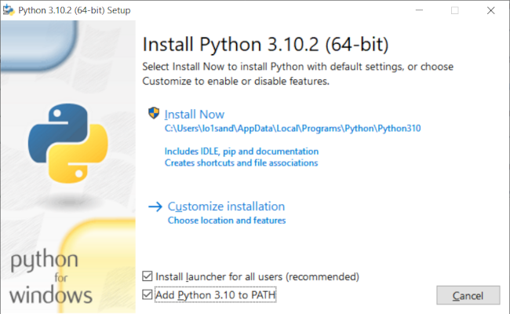

# Język Python

Python to język interpretowany, wysokiego poziomu, obiektowy, umożliwia również programowanie strukturalne i funkcyjne.

## Interpreter

Interpreter Pythona to program, który wykonuje skrypty zapisane w plikach z rozszerzeniem ".py" i polecenia wprowadzane w trybie interaktywnym. W systemach Linux interpreter jest preinstalowany. W systemie MS Windows należy go [pobrać i zainstalować](<https://linetc.readthedocs.io/pl/latest/tools/python/index.html>).



## Tryb interaktywny

Uruchom terminal (wiersz poleceń) i wpisz polecenie <code>python3</code>. Interpreter Pythona zostanie uruchomiony w trybie interaktywnym. Po znaku zachęty <code>>>></code> możesz wpisywać wyrażenia i instrukcje, które chcesz przetestować. Wpisz <code>exit()</code>, aby opuścić tryb interaktywny.

")

## Wykonywanie skryptu

Uruchom terminal (wiersz poleceń) w katalogu zawierającym skrypt, który chcesz wykonać. Wydaj polecenie:
<code>python3 nazwa_skryptu.py</code> – które spowoduje wykonanie podanego skryptu przez interpreter.

")

Skrypty Pythona możesz uruchamiać również z poziomu edytora kodu, o ile oferuje taką funkcję. Na przykład w środowisku IDLE wczytany skrypt uruchomisz naciskając klawisz <code>F5</code>.

")

## Formatowanie kodu źródłowego

- łańcuchy znaków otaczamy cudzysłowami albo pojedynczymi, albo podwójnymi
- nawiasy i cudzysłowy, o ile nie są częścią ciągu znaków, występują zawsze parami
- operatory otacza się spacjami
- dwukropek (`:`) zapowiada blok kodu, czyli wcięcia
- bloki kodu wcina się 4 spacjami i ich wielokrotnościami
- w 1 wierszu może występować maksymalnie 72 znaków
- znak `#` oznacza komentarz, przy czym:

  - pierwszy wiersz skryptu może (nie musi) zawierać wskazanie interpretera (*shebang*), np.: `#!/usr/bin/env python3`
  - skrypt może (nie musi) zawierać preferowane kodowanie znaków: `# -*- coding: utf-8 -*-`

## Co zawiera kod źródłowy?

* **Identyfikatory zmiennych**, tj. nazwy, które wskazują na wartość określonego typu, np. <code>a = 5</code>.
* **Identyfikatory słów kluczowych**, tj. nazwy zarezerwowane przez język, np.: <code>if, elif, else, for, while</code>.
* **Konkretne wartości** (tzw. literały), np. znakowe <code>"Adam"</code> lub liczbowe <code>10</code>, <code>2.345</code> – które mogą być przypisywane zmiennym.
* **Operatory**, np. arytmetyczne (<code>+, -, /, *</code>) lub porównań (<code><, >, ==, !=</code>).
* **Ograniczniki**, np. przecinek, dwukropek, nawiasy okrągłe, kwadratowe, klamrowe.
* **Wyrażenia**, tj. kombinacje zmiennych, wartości, operatorów i/lub wywołań funkcji, które są obliczane i dają jakąś wartość, np.: <code>int((a + b) / 2)</code>.

## Nazywanie zmiennych

- nazwa zaczyna się najczęściej od litery
- nazwa zawiera tylko znaki, cyfry i/lub podkreślenia, nie zawiera spacji i znaków narodowych
- rozróżniane są małe i duże litery
- używamy konwencji **snake_case** do nazywania zmiennych (także funkcji, metod, modułów i pakietów), czyli małych liter i wyrazów oddzielanych podkreśleniem, np. <code>moja_zmienna</code>

## Typ danych (ang. *data type*) i zmienne

Python wykorzystuje **typowanie dynamiczne** (ang. *duck typing*). Zmienne inicjuje się przez przypisanie im jakiejś wartości. Zmienne "przechowują" lub inaczej "wskazują na" wartości określonego typu:

- **łańcuch znaków**  (<class 'str'>, ang. *string*) – np. <code>"", '', " ", '12345'</code>
- **liczba całkowita** (<class 'int'>, ang. *integer*) – np. <code>10</code>,
- **liczba zmiennoprzecinkowa** (<class 'float'>, ang. *floating point*) – np. <code>1.2345</code>,
- **typ logiczny** (<class 'bool'>, ang. *boolean type*) – podtyp liczb całkowitych, zawiera dwie wartości: `True` (1, prawda) lub `False` (0, fałsz).

## Inicjalizowanie zmiennych

Inicjalizacja zmiennej to przypisanie jej wartości jakiegoś typu przy użyciu operatora przypisania <code>=</code>. Wartość może być wynikiem wyrażenia lub funkcji. Przykłady:

* <code>imie = "Adam"</code> – przypisanie zmiennej łańcucha znaków;
* <code>liczba = input("Podaj liczbę: ")</code> – przypisanie zmiennej łańcucha znaków zwróconego przez funkcję;
* <code>a = 5</code>, <code>pi = 3.14</code> – przypisanie zmiennym liczb: całkowitej i zmiennoprzecinkowej;
* <code>parzysta = False</code> – przypisanie zmiennej wartości logicznej;
* <code>iloczyn = (2 * a) + 1</code> – przypisanie zmiennej wartości wyrażenia.

## Operatory i ich priorytet

1. `**` – potęgowanie
2. `*, /, //, %` – mnożenie, dzielenie, dzielenie całkowite, dzielenie modulo (reszta z dzielenia)
3. `+, -` – dodawanie, odejmowanie
4. `<, <=, >, >=, !=, ==` – operatory porównań, mniejsze, mniejsze lub równe, większe, większe lub równe, różne, równe
5. `not x` – operator logiczny, negacja
6. `and` – operator logiczny, koniunkcja
7. `or` – operator logiczny, alternatywa

## Typowe operacje

- **łączenie ciągów znakowych** (tzw. konkatenacja) za pomocą operatora `+`, np. <code>"10" + "1"</code>
- **operacje arytmetyczne** zgodne z kolejnością działań: 1. nawiasy, 2. potęgowanie, 3. mnożenie, 4. dzielenie, 5. dodawanie, 6. odejmowanie – i priorytetem operatorów, np.: <code>(a + 2.5) // 2**b</code>
- **testowanie wyrażeń logicznych**, które:

  - mają wartość **True** (1) lub **False** (0), przy czym za **False** uznaje się: `None`, `False`, `0`, puste sekwencje lub kolekcje, tj. `''`, `()`, `[]`, `{}`, `set()`, `range(0)`
  - wykorzystują operatory porównań (`<, <=, >, >=, !=, ==`) i operatory logiczne `not, and, or`
  - są używane jako warunki, np.: `a == b` – operacja porównania

- **pobieranie danych z klawiatury** – instrukcja wejścia `input("komunikat dla użytkownika")` zwraca dane jako tekst (typ <code>str</code>!)
- **wypisywanie komunikatów** – instrukcja `print("komunikat")` wypisuje znaki lub zmienne w terminalu

  - `print("komunikat", a)` – wypisanie ciągu znaków i wartości zmiennej <code>a</code>
  - `print(*lista)` – wypisanie elementów listy (sekwencji)
  - `print(f"{a} jest większe od {b}")` – wypisanie ciągu formatowanego (tzw. *f-string*), w miejsce nawiasów klamrowych wstawiane są wartości zmiennych lub wyrażeń

- **rzutowanie typów danych**:

  - `int("123")` – zamiana tekstu na liczbę całkowitą
  - `float("2.5")` – zamiana na liczbę zmiennoprzecinkową
  - `str(10)` – zamiana np. liczby na tekst

## Instrukcja warunkowa

Ogólna forma:

```Python
if warunek1:
    instrukcja lub blok instrukcji wykonywanych gdy warunek1 jest prawdą
elif warunek2:
    instrukcja lub blok instrukcji wykonywanych gdy warunek2 jest prawdą
else:
    instrukcja lub blok instrukcji wykonywanych gdy warunki nie są prawdziwe
```

Przykłady:

```Python
# sprawdzamy, czy a jest parzyste
if a % 2 == 0:
    print("Liczba", a, "jest parzysta!")
else:
    print("Liczba", a, "nie jest parzysta!")
```

Forma z dodatkowym testem:

```Python
# sprawdzamy, czy a jest większe, czy równe b
if a > b:
    printf("Liczba {a} jest większa od {b}!")
elif a == b:
    printf("Liczby {a} i {b} są równe!")
else:
    printf("Liczba {a} jest mniejsza od {b}!")
```

Zagnieżdżanie instrukcji warunkowych:

```Python
# sprawdzamy, czy a jest większe od b i c
if a > b:
    # ewentualna instrukcja lub instrukcje
    if a > c:
        print("Liczba {a} jest największa.")
else:
    ewentualna instrukcja lub instrukcje
```

Zastąpienie zagnieżdżonych instrukcji warunkowych warunkiem złożonym:

```Python
if a > b and a > c:
    print("Liczba {a} jest największa.")
elif a == b or a == c:
    print("Liczba a jest równa b lub c.")
else:
    print("Liczba a jest mniejsza od b lub c.")
```

## Instrukcje iteracji (pętle)

Przykłady pętli <code>for</code> (wykonuje się określoną liczbę razy):

```Python
# pętla, która wykona się 10 razy
for i in range(10):
    print(i)  # powtarzana instrukcja wypisująca wartość i

# pętla, która odczyta wszystkie znaki z napisu
napis = "abcde"
for znak in napis:
    print(znak)  # powtarzana instrukcja wypisująca kolejne znaki
```

Przykłady pętli <code>while</code> (wykonuje się, dopóki warunek jest prawdziwy):

```Python
# pętla, która wykonuje się dopóki warunek a > 0 jest prawdziwy
a = 10
while a > 0:
    a = a - 1

# pętla, która pobiera liczbę z klawiatury, dopóki liczba jest ujemna lub równa 0
liczba = int(input("Podaj liczbę: "))
while liczba <= 0:
    liczba = int(input("Podaj liczbę: "))
```

## Najczęstsze typy błędów

- **IndentationError** – błąd wcięcia, najczęściej polega na niezachowywaniu tych samych wcięć w bloku kodu
- **TypeError** – błąd typu, występuje, kiedy chcemy wykonać operację na złym typie danych
- **NameError** – błąd nazwy, występuje, kiedy używamy niezdefiniowanej nazwy, np. niezainicjowanej zmiennej, błędnie zapisanej funkcji itp.
